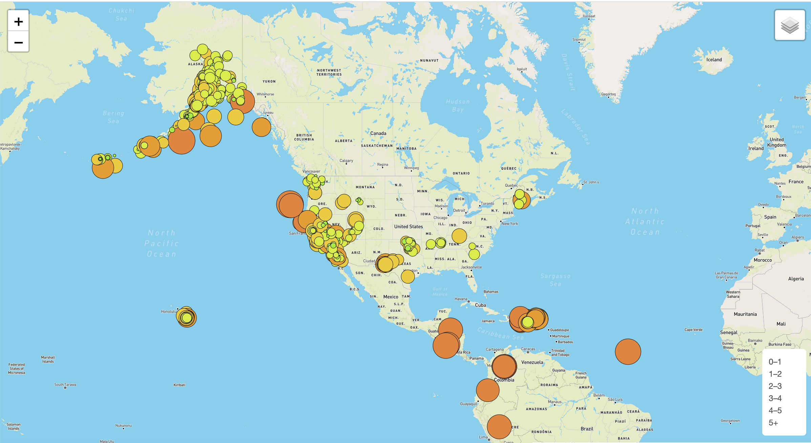

# Mapping Earthquakes

HTML interactive practice using leaflet and JavaScript to display different layers on a map, retrieve information about earthquakes and play with different functionalities of map visualizations. 

Final goal was to use the information to display on a world map, the location and magnitude of an earthquake on the data collected from the Earthquake Hazards Program by U.S. Geological Survey.

